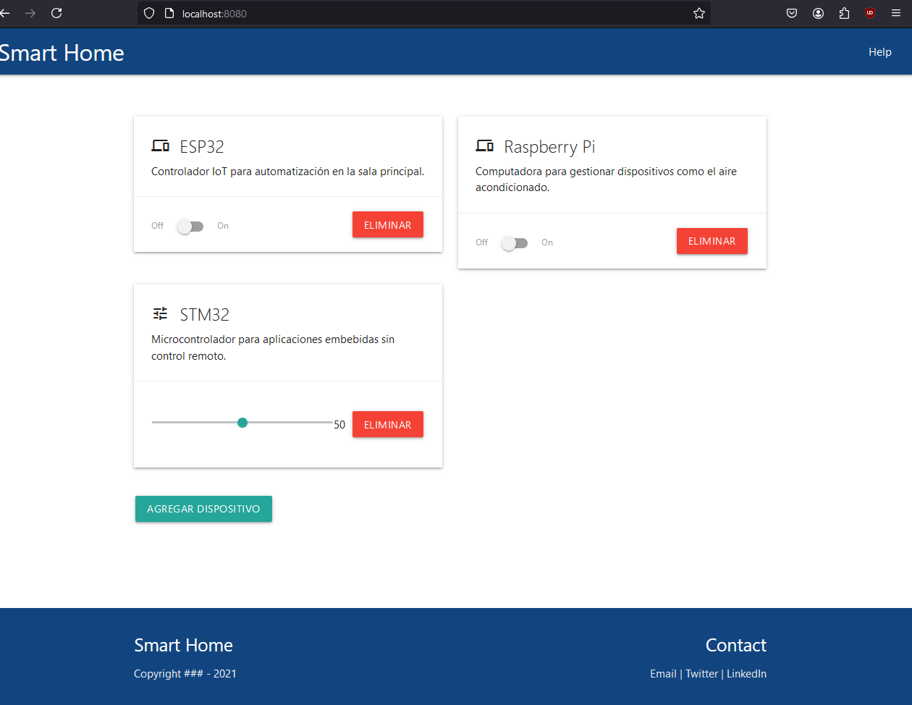
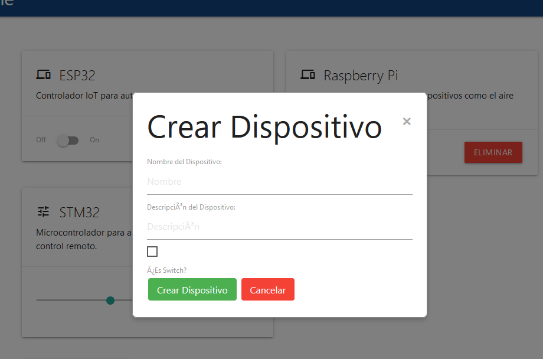

# app-fullstack-base-2024-i10

Este repositorio contiene una aplicación fullstack base para el proyecto Master IoT. Está dividido en varios componentes importantes, pero lo más relevante está en el directorio `src`, donde se encuentran el frontend y el backend. También cuenta con un archivo `docker-compose.yml` que facilita la configuración del entorno usando Docker.

## Estructura del Proyecto

La estructura de carpetas es la siguiente:

```
/db
/doc
/src
    /frontend
    /backend
.gitignore
CHANGELOG.md
Contribuitors.md
data.sql
docker-compose.yml
init-db.sh
LICENSE
README.md
```

### Directorios Clave:

- **src/**: Contiene el código fuente del frontend y backend.
  - **frontend/**: Código de la interfaz de usuario (UI), generalmente construido con frameworks como React o Vue.
  - **backend/**: Código del servidor, normalmente una API en Node.js, Express u otro framework backend.
  
- **db/**: Scripts y configuraciones relacionadas con la base de datos.
  
- **doc/**: Documentación del proyecto.
  
- **data.sql**: Archivo SQL usado para inicializar la base de datos PostgreSQL.

- **docker-compose.yml**: Archivo para configurar y levantar los servicios de Docker.

## Cómo levantar el entorno con Docker Compose

El archivo `docker-compose.yml` contiene los servicios necesarios para levantar la aplicación fullstack. A continuación se explica cada servicio:

- **frontend**: Levanta el servidor del frontend, que se puede acceder en el puerto `8080` del host.
- **backend**: Levanta el servidor backend que expone la API en el puerto `4000`.
- **postgres**: Base de datos PostgreSQL. Usa la imagen `postgres:15.3` y carga el archivo `data.sql` al inicio.

### Comandos para levantar el entorno

1. Asegúrate de tener Docker y Docker Compose instalados en tu sistema.
2. Ejecuta el siguiente comando en la raíz del proyecto para levantar todos los servicios:

```bash
docker-compose up --build
```

Esto construirá las imágenes y levantará los contenedores de frontend, backend y PostgreSQL.

- El frontend estará disponible en `http://localhost:8080`
- El backend estará disponible en `http://localhost:4000`
- La base de datos PostgreSQL estará corriendo en el puerto `5432`

## Imágenes

Aquí se muestran las imágenes relacionadas con la arquitectura del proyecto:





## Licencia

Este proyecto está licenciado bajo la licencia MIT. Ver [LICENSE](./LICENSE) para más detalles.
